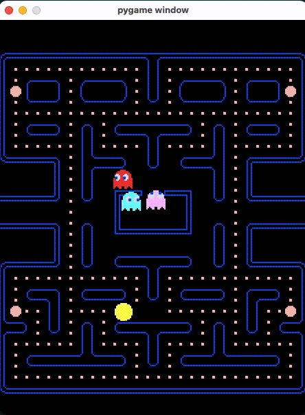

# Pacman remake

This is a remake of the Pacman game, written in Python using pygame.

## Prerequisites

Before you begin, ensure you have met the following requirements:

* You have installed the latest python (tested in python >= 3.8)
* You have installed pygame v2.0
```
pip3 install pygame
```

## Running Pacman remake
To run the game, follow these steps:

Linux and macOS:

```
python3 main.py
```

Windows:

```
```

## WIP Demo

